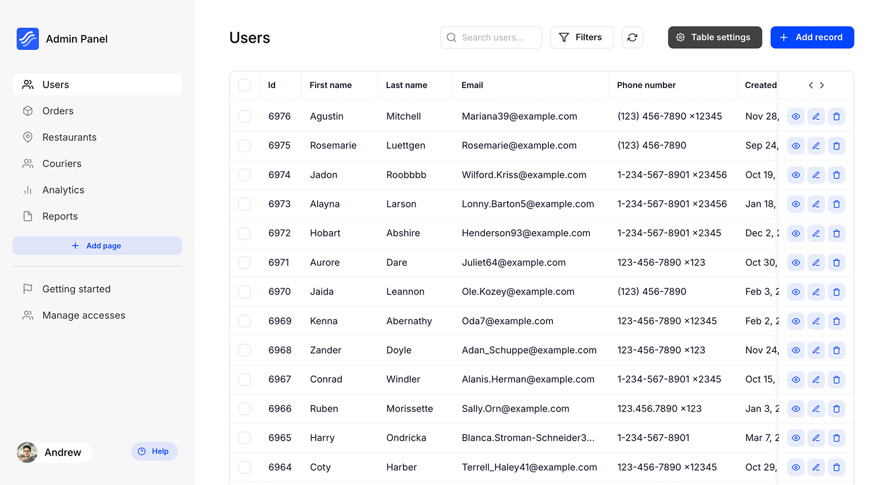
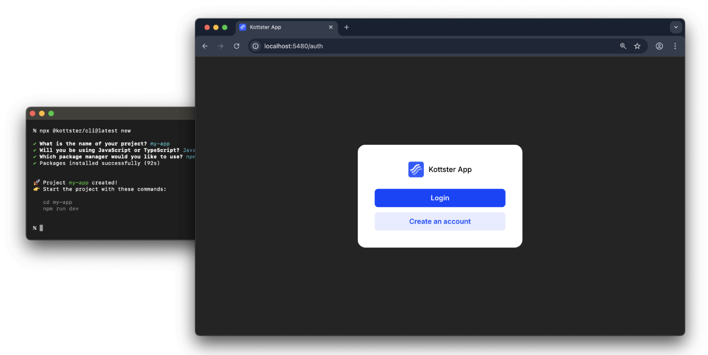
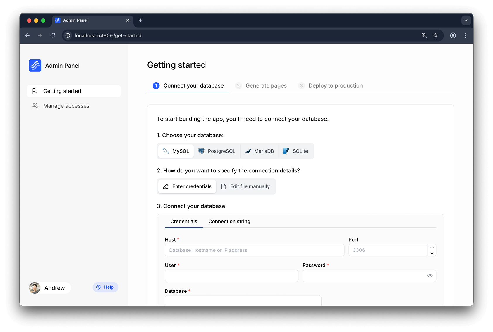
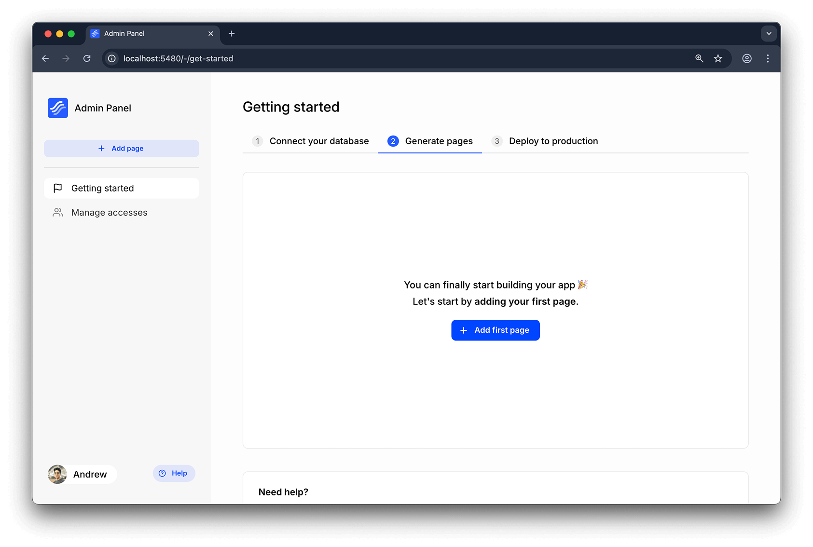
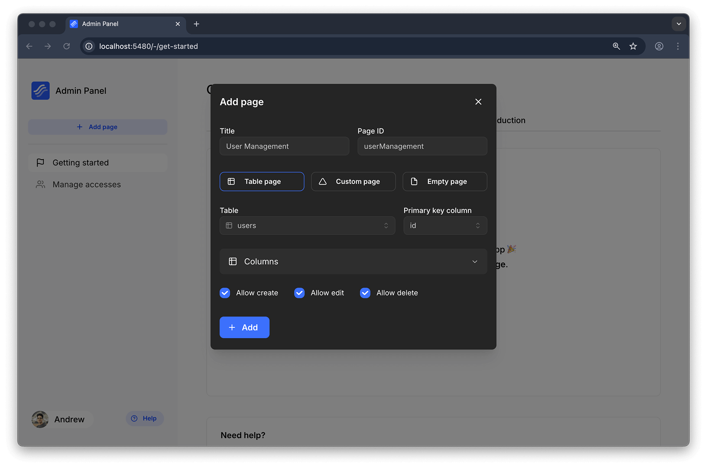
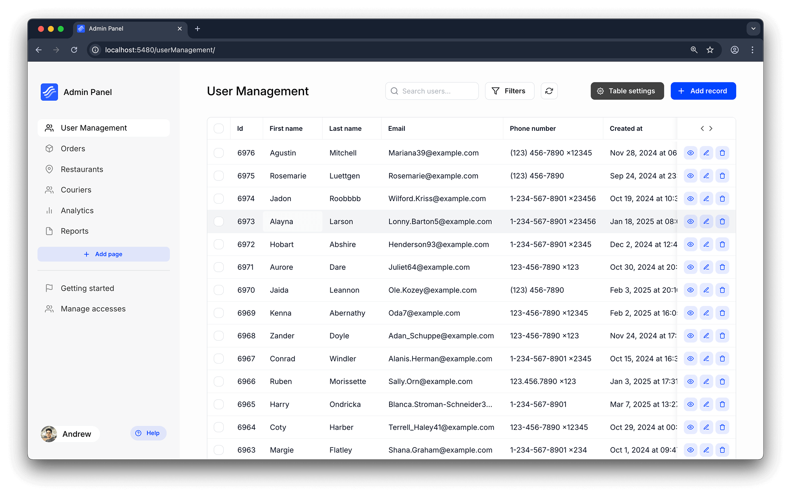
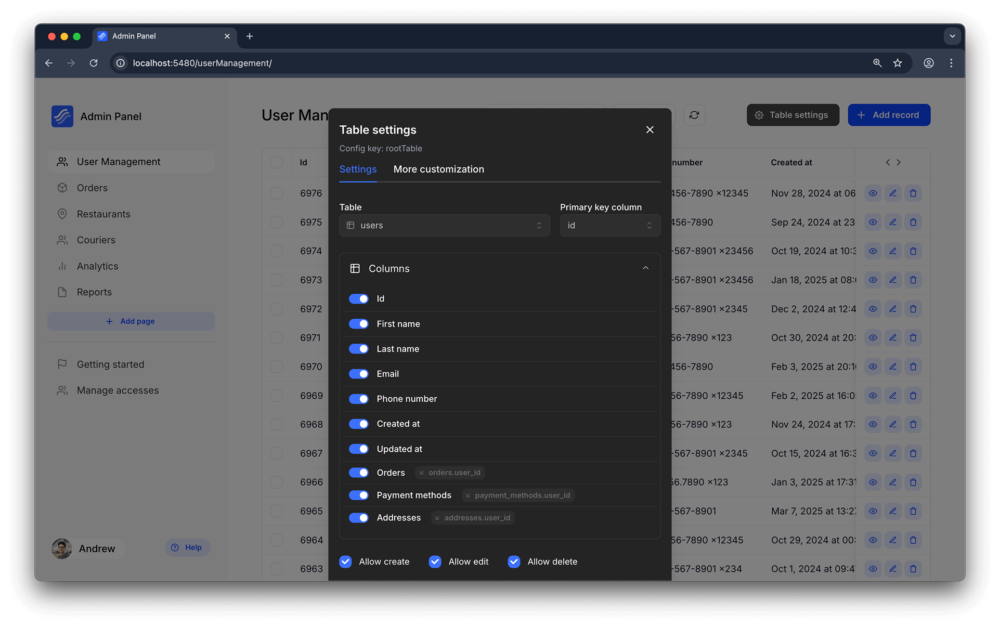
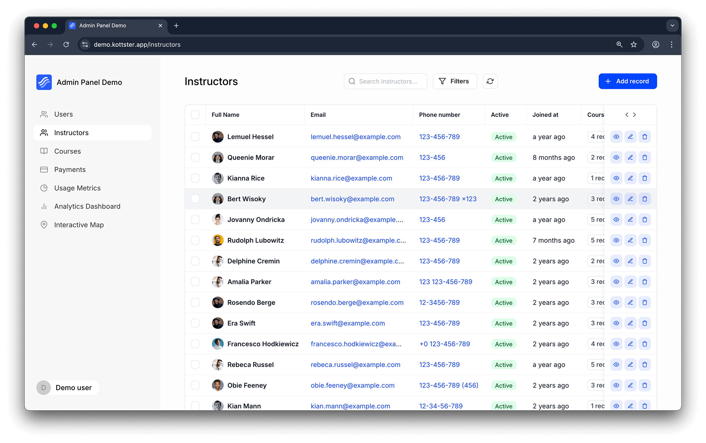
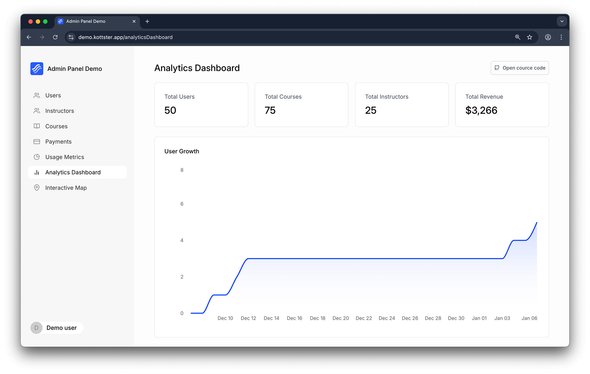
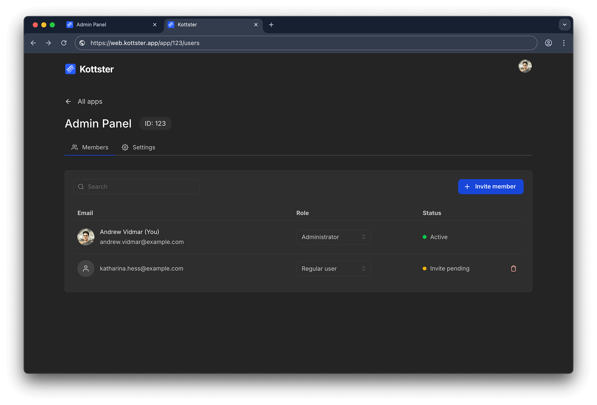

# Node.js Admin Panel

This tutorial shows you how to quickly create a custom Node.js admin panel using [Kottster](https://kottster.app). Kottster is an open-source tool that lets you build a self-hosted admin panel on top of your database.

[Website](https://kottster.app) ⋅ [Documentation](https://docs.kottster.app) ⋅ [Live Demo](https://demo.kottster.app) ⋅ [GitHub](https://github.com/kottster/kottster)



## Requirements

- [Node.js](https://nodejs.org/) version 20 or above installed on your machine.
- npm (comes with Node.js).

## Getting Started

### Creating a New Project

Run the following command to create a new project:

```bash
npx @kottster/cli@latest new
```

Answer the questions, and it will create a new project in a folder.

Alternatively, you can use Docker to run Kottster. Check out our guide: [Quickstart with Docker](https://docs.kottster.app/quickstart-docker).

After the project is created, open the project folder and run:

```bash
npm run dev
```

This will start the server at `http://localhost:5480`. If port 5480 is already in use, Kottster will pick a different one.

Open your browser and go to http://localhost:5480. You'll see an authentication screen. Create a new account there to continue.



After creating an account, you'll be asked to **initialize your local app by giving it a name**. Once completed, you'll be redirected into your local app.



### Connect to Your Database

After opening your app, the first thing you'll need to do is connect to a database. Select the database you want to connect to (PostgreSQL, MySQL/MariaDB, SQLite, or Microsoft SQL).

You can either:

- Enter your database credentials directly on the screen

- Create a configuration file manually

> Important: All database credentials you provide are secure and stored only locally within your own self-hosted app.

After successfully connecting your database, you can start building your admin panel.



## Create Your First Page

To create a new page, click on the "Add page" button in the sidebar.



There are several types of pages you can create in Kottster:

### Table Page

It's a page that allows to view and edit data from a database table. It has all the basic CRUD operations (Create, Read, Update, Delete) and allows you to filter, sort, and search the data.



You can also customize the table using a convenient visual editor. For more advanced customization, you can edit the table configuration in the source file: `app/router/<page-name>/index.js`.



You can change how the table looks and works. You can add custom columns, change the layout, and add your own actions.

For example, here's a page with a custom column called "Full name" that combines first and last name, and also shows an avatar image:



### Custom Page

You can also create a completely custom admin page with your own logic and UI.



## User Management and Security

Kottster has a built-in user management system that allows you to invite users, assign roles, and manage permissions.



# Conclusion

Ready to get started? Head over to [Kottster](https://kottster.app) and build your own admin panel in minutes.
